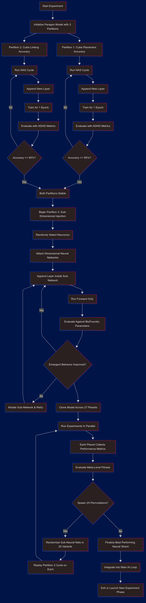

# SPARSE: Staged Partitioned Architecture Search with Sub-Neural Dimensional Evaluation

Welcome to the **SPARSE Protocol**, an experimental framework for developing intelligent neural structures through gated training, dimensional injection, and emergent behavior evaluation across distributed simulations.

## 🧠 Overview

**SPARSE** (Staged Partitioned Architecture Search with Sub-Neural Dimensional Evaluation) is a novel AI experiment protocol structured into three key partitions:

1. **Partition 1**: Learns cube placement via layer-wise Neural Architecture Search (NAS) and gradient-based training.
2. **Partition 2**: Optimizes cube linking and connection accuracy.
3. **Partition 3**: After achieving stability in Partitions 1 & 2 (ADHD accuracy ≥ 95%), randomly injects sub-networks into neurons and evaluates emergent behavior across 27 planet-scale environments.

The goal is **emergent generalization**—enabling a cube-based construct (e.g., an AI "dog") to adapt and navigate checkpoints across diverse terrains and physics.

## 🧪 Protocol Flow

This flowchart details the progression through partitions, dimensional injection, and behavior evaluation across 20 permutations and 27 planets.

## 🔬 Components

| Component                  | Description                                                                      |
| -------------------------- | -------------------------------------------------------------------------------- |
| **ADHD Metrics**           | Custom gating metric based on deviation and emergent fitness (Partitions 1 & 2). |
| **Layer-wise NAS**         | Evolves architecture layer by layer, trained for one epoch before evaluation.    |
| **Sub-Neural Injection**   | Appends layers inside neurons in Partition 3, evaluated without training.        |
| **BioFoundry Environment** | 27 planets with unique rotation, gravity, and terrain.                           |
| **Permutation Engine**     | Tests 20 randomized sub-network variants per model for generalization.           |

## 🌌 Emergence Philosophy

SPARSE prioritizes emergent intelligence over handcrafted solutions:

- No supervision in Partition 3.
- No reward shaping.
- No backpropagation beyond initial structure.
- Intelligence arises from architecture, environment, and movement.

The first roll, twitch, or leap emerges purely from structure and mutation.

## 🚀 Next Phase: GENESIS (Meta-Generalization)

SPARSE outputs will feed into **GENESIS**, a higher-order model that:

- Generalizes across SPARSE runs.
- Synthesizes hybrid architectures.
- Builds adaptable neural controllers from evolutionary fragments.
